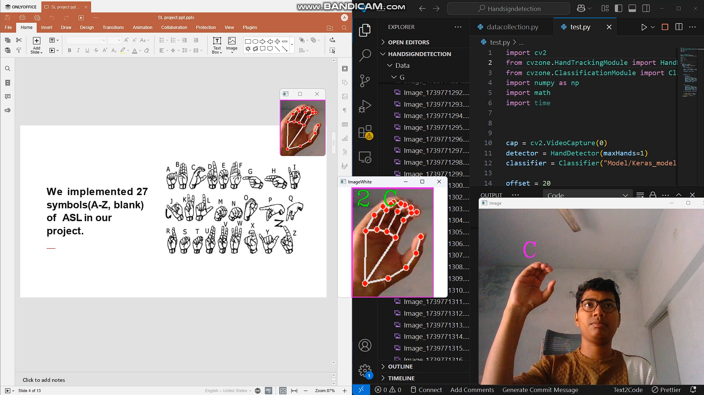
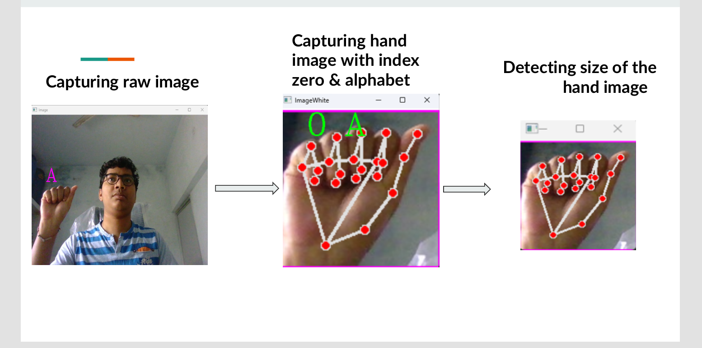
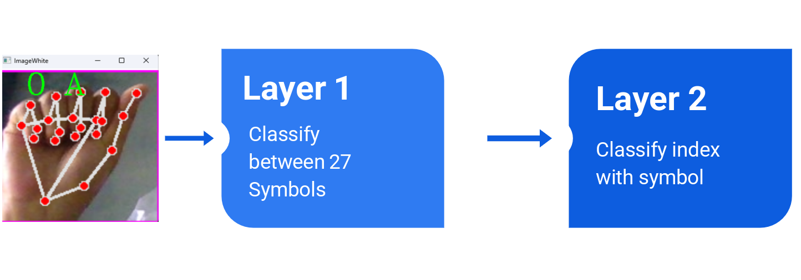

# 🤟 Sign Language Detection System

A Machine Learning and Computer Vision based Sign Language Recognition system that detects and translates hand gestures into alphabet symbols in real time.

This project helps in improving communication for people using sign language by recognizing hand movements using AI.

---

## 🚀 Project Demo





---

## 📌 Features

- Real-time hand gesture detection
- Recognizes A-Z alphabets
- Computer Vision based hand tracking
- Deep Learning classification model
- Live webcam support
- Fast prediction system

---

## 🧠 How System Works





### Step 1: Capture Hand Image

The system captures live hand gestures using webcam.

### Step 2: Hand Detection

Computer Vision techniques detect hand landmarks and extract useful features.

### Step 3: Gesture Classification

The trained deep learning model classifies the detected gesture.

### Step 4: Output Prediction

The system displays the predicted alphabet.

---

## 🏗️ Model Architecture





- Layer 1:
  - Classifies hand gesture features
  - Detects symbols

- Layer 2:
  - Maps detected symbol index
  - Gives final alphabet output


---

## 🛠️ Technologies Used

- Python
- OpenCV
- CVZone
- TensorFlow / Keras
- Machine Learning
- Deep Learning
- Computer Vision


---

## 📂 Project Structure

Sign-language-model

├── Data
├── Model
├── datacollection.py
├── test.py
├── requirements.txt
└── README.md


---

## ⚙️ Installation


Clone Repository

```bash
git clone https://github.com/Mohithub123/Sign-language-model-.git


## Install Requirements
pip install -r requirements.txt

## Run Project
python test.py

📸 Output

Real time alphabet prediction from hand signs.

👨‍💻 Author

Mohit Chandravanshi

